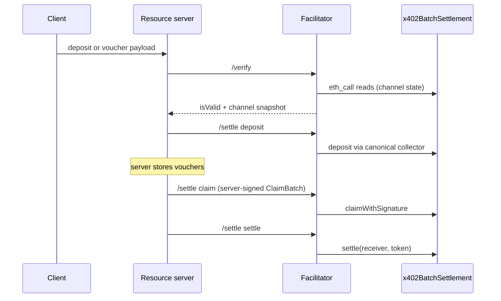

# Batch settlement facilitator

## Summary

The `v2-eip155-batch-settlement` scheme lets a client fund an onchain payment
channel once and then pay per request with signed cumulative vouchers. The
resource server keeps the vouchers, claims them onchain in batches, and sweeps
claimed funds to its receiver. This facilitator checks payloads, simulates and
submits the contract calls, and pays gas. It holds no receiver-authorizer key:
the resource server signs every claim and every refund authorization itself.

This guide is for operators of the bundled facilitator and for resource-server
developers who integrate with it. It covers configuration, the authority
model, the checks, and the settlement outcomes. The wire format is in the
[scheme spec](specs/schemes/batch-settlement/scheme_batch_settlement_evm.md).
General facilitator setup is in the [facilitator README](../facilitator/README.md).



## Authority model

The contract fixes where funds go. Authorizer control is not payout control.

Anyone can submit each of these operations:

- `deposit`: the payer's ERC-3009 or Permit2 authorization, plus a voucher.
  Funds go into the channel escrow.
- `claimWithSignature`: the receiver authorizer's signature over the whole
  batch, plus a payer voucher for each row that moves `totalClaimed`. No
  transfer; accounting only.
- `settle(receiver, token)`: no signature. Funds go only to the recorded
  `receiver`.
- `refundWithSignature`: the receiver authorizer's signature over
  `(channelId, nonce, amount)`. Funds go only to the channel `payer`.

The resource server keeps the receiver-authorizer key. The facilitator never
signs for the server, and `/supported` advertises no `receiverAuthorizer`. A
claim or refund payload without its authorizer signature fails with
`invalid_batch_settlement_evm_authorizer_not_configured`.

## Configuration

Enable the scheme per chain in `config.json`. The scheme takes no options.

```json
{
  "id": "v2-eip155-batch-settlement",
  "chains": "eip155:143"
}
```

- Enable only chains where the canonical contracts have code. Monad mainnet
  (`eip155:143`) is verified. Monad testnet has no deployment; keep it off.
- Any key in `config` makes the builder fail. The registry then logs the
  error and registers no handler, so `/supported` omits the scheme.
- The scheme uses the canonical addresses only. There is no override.

| Contract | Address |
| --- | --- |
| `x402BatchSettlement` | `0x4020074e9dF2ce1deE5A9C1b5c3f541D02a10003` |
| `ERC3009DepositCollector` | `0x4020806089470a89826cB9fB1f4059150b550004` |
| `Permit2DepositCollector` | `0x4020425FAf3B746C082C2f942b4E5159887B0005` |

The facilitator pays gas for every write it accepts. The scheme has no gas
budget per channel. Restrict access to `/settle` at the network layer.

## Verify

`/verify` accepts `deposit`, `voucher`, and client `refund` payloads. Other
types fail with `invalid_batch_settlement_evm_payload_type`. The checks run in
this order:

1. `accepted.network`, `paymentRequirements.network`, and the provider chain
   must be the same chain.
2. The channel config must hash to `voucher.channelId` on this chain.
3. `receiver`, `token`, and `receiverAuthorizer` must equal `payTo`, `asset`,
   and `extra.receiverAuthorizer`. A missing or zero `extra.receiverAuthorizer`
   fails with `receiver_authorizer_mismatch`, because nothing then shows the
   merchant's consent. `withdrawDelay` must equal `extra.withdrawDelay` only
   when the server sends that field. The delay must be 900 to 2,592,000 s.
4. The voucher signature must be valid (see [Signature rules](#signature-rules)).
5. The channel must have a balance. `maxClaimableAmount` must not exceed it.
6. A paid voucher must exceed `totalClaimed`. A refund voucher can equal it.

For a payer with code, the verdict of step 4 comes after steps 5 and 6. It is
a claim simulation against the state that those steps read.

A deposit adds these checks: a nonzero `uint128` amount, a valid ERC-3009 or
Permit2 authorization, enough payer token balance, a Permit2 allowance for
Permit2, and a `deposit` simulation. A deposit voucher can equal
`totalClaimed`, as the spec error table and the Go reference allow.

Every amount and nonce is a decimal string of ASCII digits; `""`, `_`, `+`,
and spaces fail to parse. `withdrawDelay` is a JSON number that must fit the
contract's `uint40`; a wider value fails to parse on every path.

A valid response returns the onchain snapshot as decimal strings in `extra`.
A deposit reports the state before the deposit, not a projected balance.

## Settle

`/settle` accepts `deposit`, `claim`, `settle`, and server-completed `refund`
payloads. A bare `voucher` or client `refund` fails with `payload_type`.

Checks before broadcast, and the source of `amount` in the response:

- `deposit`: all `/verify` deposit checks. `amount` comes from the `Deposited`
  event.
- `claim`: a shared authorizer, the authorizer signature, the payer vouchers
  for rows that move `totalClaimed`, ceilings, and balances. `amount` is `""`
  (no transfer).
- `settle`: the gas estimate at the block of the `receivers(receiver, token)`
  read succeeds. `amount` comes from the `Settled` event, or is `"0"`.
- `refund`: `voucher.channelId` must be the id of `channelConfig`. Then a
  nonzero amount, the current `refundNonce`, the authorizer signatures, and
  unclaimed escrow after bundled claims. `amount` comes from the `Refunded`
  event.

A claim reads `channels(id)` for every distinct channel in one `eth_call`
of the settlement contract's own `multicall`, at one pinned block. The number
of channel-state reads does not change with the number of rows. Each row that
raises `totalClaimed` with a zero `payerAuthorizer` adds one `eth_getCode`
read of the payer.

Claim rows can name different receivers and tokens if they share one
`receiverAuthorizer`. A refund can bundle claims for other channels in one
`multicall`. Only the refunded channel's own state limits the refund.

### Channel-manager requests

The official SDK channel managers (`@x402/evm` and Go) send claim, settle, and
refund with placeholder requirements: `amount: "0"`, `maxTimeoutSeconds: 0`,
and `extra: {}`, for both `accepted` and `paymentRequirements`. The signed
payload carries the merchant's consent, so these three actions read no
requirement field except `network`. Every `extra` field is optional on the
wire. `/verify` and deposits still need `extra.receiverAuthorizer`.

### Idempotent claim and settle

A channel manager records claimed totals, and clears its pending settle, only
when `success` is `true`. A lost update makes it send the same work again. The
facilitator therefore reports success when the chain already holds the goal
state:

- **Every claim row is already claimed.** The facilitator runs the canonical
  `claimWithSignature` as an `eth_call` at the read block. At that block the
  call checks only the authorizer signature and the shared authorizer. If it
  passes, the response is `success: true`, `transaction: ""`, `amount: ""`, and
  nothing is broadcast. A signature that the contract rejects fails with
  `claim_simulation_failed`, also for an authorizer with code. Stale rows next
  to a new row stay in the batch, because the contract skips them.
- **A claim mines with no `Claimed` event.** Another claim reached the totals
  first. The response is `success: true` with the hash.
- **A `settle` has nothing owed.** An earlier settle swept the funds. `settle`
  needs no signature. The response is `success: true`, `transaction: ""`,
  `amount: "0"`, and nothing is broadcast.
- **A `settle` mines with no `Settled` event** for this receiver and token.
  Another settle landed first. The response is `success: true` with the hash
  and `amount: "0"`.

An empty claim batch still fails. A refund with no unclaimed escrow after the
bundled claims still fails before broadcast
(`invalid_batch_settlement_evm_refund_no_balance`), because the contract would
still advance `refundNonce`.

The `settle` gas limit is the node's `eth_estimateGas` result, taken at the
block of the `receivers` read. `settle` is cheap when nothing is owed, and the
token sets the cost of the transfer, so no fixed limit fits every token. The
pinned block keeps a lagging node from pricing the cheap path.

## Signature rules

For a signer without code, the facilitator applies the contract's ECDSA rule
locally. For a signer with code, the contract calls the wallet's ERC-1271
function from its own address in a static call. No direct call to the wallet
has that caller and context, so the facilitator lets a canonical contract call
decide.

- Voucher, nonzero `payerAuthorizer`: the contract uses
  `ECDSA.recoverCalldata`. The facilitator requires 65 bytes, `v` 27 or 28,
  and low `s`, even if the address has code. It makes no RPC call.
- Voucher, zero `payerAuthorizer`: the contract uses `SignatureChecker`
  against `payer`. No code: strict ECDSA. Code: a read-only `claim([row])`
  from a receiver-side account (see below).
- Claim batch and refund: the contract uses `SignatureChecker` against
  `receiverAuthorizer`. No code: strict ECDSA. Code: the write simulation, or
  for an already-claimed batch the claim call at the read block.
- ERC-3009 deposit: the token (FiatToken) uses `SignatureChecker`. No code:
  strict ECDSA. Code: the `deposit` simulation.
- Permit2 deposit: Permit2 uses `SignatureVerification`. No code: 65 or 64
  bytes, any `s`. Code: the `deposit` simulation.

Each signature uses the EIP-712 domain of the contract that checks it:

- `Voucher`, `ClaimBatch`, and `Refund`: `x402 Batch Settlement`, version `1`,
  with the settlement contract as `verifyingContract`.
- ERC-3009 `ReceiveWithAuthorization`: the token's `extra.name` and
  `extra.version`, with the token as `verifyingContract`.
- Permit2 `PermitWitnessTransferFrom`: `Permit2`, with no version, and Permit2
  as `verifyingContract`.

For a voucher from a payer with code, the facilitator runs `eth_call` of
`claim([row])` on the settlement contract, with
`totalClaimed = maxClaimableAmount`. The call reads state at the same block as
the channel read. It needs no key, has no state override, and is never
broadcast. For a deposit, the call is `multicall([deposit, claim([row])])`, so
the claim sees the deposit. `InvalidSignature()` gives
`invalid_batch_settlement_evm_voucher_signature`.

The `from` of this call is also `tx.origin`, and the wallet can read it.
`claim` accepts `receiver` and `receiverAuthorizer` as callers. The facilitator
reads the code of these addresses at the block of the channel read. It uses
the first address that can send a transaction:

1. `receiverAuthorizer`, if it has no code or has EIP-7702 delegation code (23
   bytes that start with `0xef0100`).
2. Else `receiver`, if it has no code or has delegation code.

Other code has no known private key, so that address is never the origin of a
real claim. If both addresses have other code, no simulation runs. The result
is `claim_simulation_failed` for a voucher and `deposit_simulation_failed` for
a deposit, with the message `no receiver-side account can send a claim
transaction`. A failed code read gives `rpc_read_failed`.

The simulation checks the supplied signature through the canonical contract in
one context: one origin, one block, and the gas and time values of that
`eth_call`. It does not prove that a later relayed claim succeeds. A relayed
`claimWithSignature` has the facilitator signer as `tx.origin`. A wallet can
reject that origin, or a different block, gas, or time. It needs no change to
the wallet or to any state to do this. `/settle` simulates the exact claim
from the broadcast signer, so such a claim gets `claim_simulation_failed` and
no broadcast. The merchant can try a direct claim from the account that
`/verify` used. A later state change can still prevent that claim.

- `claim` skips a row that does not raise `totalClaimed`. A voucher that
  equals `totalClaimed` (a refund voucher, or a deposit top-up) pays for
  nothing above the claimed total, and no contract call checks it. For that
  case only, the facilitator calls the wallet's `isValidSignature` directly.
  That call is not the onchain check, and it reads no receiver-side code.
- A nonzero `payerAuthorizer` uses fixed ECDSA rules and no wallet call, so
  the call context has no effect on its vouchers.
- An account with code never falls back to ECDSA. This includes an EOA with
  EIP-7702 delegation code.
- Signature bytes go to the contract unchanged. The facilitator does not
  unwrap ERC-6492 and does not deploy counterfactual wallets.

## Outcomes

Every write is simulated from the signer that then broadcasts it. The
facilitator broadcasts at most once per request. It records deposit broadcasts
for retry reconciliation.

**Read `success` in the body; do not use the HTTP status.** Every `/settle`
result in this table has HTTP 200, and every `/verify` result has HTTP 200
with `isValid`. Only a request that fails to parse gets an error status. The
`exact` and `upto` schemes use non-2xx statuses for failures; this scheme does
not.

`errorMessage` and `invalidMessage` hold an EVM revert reason and its data,
or fixed text such as `RPC request failed`. They never hold transport error
text, which can contain the RPC URL and its key. With the `telemetry`
feature of this crate, some RPC failures also write a `warn` log line with
the full error. A failed single-channel state read, payer token-balance read,
or Permit2 allowance read writes no log line. Without `telemetry`, no batch
log line holds an RPC error.

| Outcome | `success` | `errorReason` | `transaction` |
| --- | --- | --- | --- |
| Check or simulation failed | `false` | Scheme error code | `""` |
| Claim or settle already done, no broadcast | `true` | none | `""` |
| Mined and reverted | `false` | `..._transaction_failed` | Transaction hash |
| Claim or settle mined without its event | `true` | none | Transaction hash |
| Deposit or refund mined without its event | `false` | Action error code | Transaction hash |
| Broadcast, receipt not confirmed | `false` | `settlement_pending` | Transaction hash |
| Mined with the expected event | `true` | none | Transaction hash |

For a deposit, the official SDK retries `settlement_pending` with the same
request. The facilitator reads the recorded transaction receipt and returns
its result. It does not broadcast again. A changed request that spends the same
authorization gets `deposit_payload` and cannot reuse that result.

In one process, only one request for each deposit authorization can run the
checks and broadcast at a time. An identical request that arrives during that
time waits. It then reads the receipt of the first transaction. A changed
request gets `deposit_payload` at once. A request for another authorization
does not wait. If the first request ends before a broadcast, or its
transaction reverts, the next identical request runs every check again.

The facilitator records an unconfirmed broadcast or one that mined with success.
An identical request in the next five minutes reads that transaction's receipt
and returns its hash. The result can change as it confirms. The store holds at most
10,000 records and requests in progress. When it is full, it removes the
oldest record. If all 10,000 are requests in progress, a new deposit gets
`deposit_transaction_failed` with no broadcast. A restart, another instance,
expiry, or eviction loses that protection. A request with no record runs every
deposit check again. Route retries to the same instance. If the settle request
stops after the broadcast and before the send returns, the facilitator records
nothing. The next identical request can then broadcast a second time, and one
of the two transactions reverts. The deposit can land while the facilitator
reports a failure. Read the channel state before you treat that deposit as failed.
For other operations, inspect
the returned transaction hash before a retry: the transaction can still land.

The settle response `extra.channelState` holds the channel state at the end of
the receipt's block. It includes later transactions in the same block. If that
read fails, the response stays successful, omits `extra`, and says so in
`errorMessage`. The facilitator does not calculate a state to put in its
place. The transferred amount always comes from this transaction's event,
never from a state difference.

A missing snapshot has an effect on the official TypeScript resource server:

- Refund: the `afterSettle` hook throws `ErrRefundPayload`
  (`server/utils.ts` `parseRefundSettlementSnapshot`). The refund landed, but
  the server keeps its old channel record.
- Deposit: the hook keeps its old local `balance`, `totalClaimed`,
  `withdrawRequestedAt`, and `refundNonce` (`server/settle.ts`
  `readExtraString`). The record then shows the balance before the deposit.

In both cases, refresh the channel state from the chain before the next
request on that channel.

## Log events

Each completed batch verify or settle with a zero `payerAuthorizer` writes one `tracing` event.
The `facilitator` feature includes these events; `telemetry` is not necessary. The target is
`x402_chain_eip155::v2_eip155_batch_settlement::facilitator::zero_authorizer_log`.

- A success is a `debug` event. A failure is one `warn` event, also for a
  claim batch with many rows.
- The fields are `operation`, `payload_type`, `chain_id`, `vouchers`,
  `zero_authorizer_vouchers`, and on a failure the canonical `reason`.
  `channel_id` and `payer` are present only for a request with one voucher.
  `transaction` is present when the settle response has a hash.
- `payer` and `channel_id` come from the request. A failed event does not prove that this payer
  signed or sent the request.
- `settlement_pending` means an unknown transaction result, not a mined revert.
- A zero address does not prove that the payer is a contract wallet or that
  the request is an attack.
- An event for a failed batch names no failed row, because the contract
  reverts the full batch. It also does not prove that a row passed `/verify`.
- The events hold no signature, payload, calldata, RPC error text, or
  response message. They make no RPC call and do not change the response.
- Requests rejected before this stage, or stopped before a result, do not
  produce these events.

## Resource server responsibilities

The facilitator keeps no channel state. The server must:

- Keep the receiver-authorizer key and sign each `ClaimBatch` and `Refund`.
  With the official SDK, set `receiverAuthorizerSigner` on the server scheme.
  Without it, the SDK server fails at startup, because this facilitator
  advertises no `receiverAuthorizer`.
- The authorizer can be an EOA or a contract. Canonical simulations check
  a contract's ERC-1271 signature. A paid zero-authorizer voucher from a
  payer with code also needs a receiver-side account that can send a
  transaction. If neither account qualifies, `/verify` rejects that voucher.
- Store vouchers and the cumulative charge per channel. The facilitator never
  sets `chargedCumulativeAmount`.
- Claim before a timed withdrawal can finish. Watch `withdrawRequestedAt` in
  every snapshot.
- Choose a policy for channels with a zero `payerAuthorizer`. The server can
  require nonzero before service, accept the collection risk, or wait for a
  confirmed claim. These are server policies, not protocol requirements.
  For a payer with code, `/verify` checks one context at one block. A later
  relayed claim can fail without any state change. A direct claim from the account
  that `/verify` used can be necessary. Nonzero uses fixed ECDSA rules and avoids this
  wallet-context problem.
- To exclude a row from a failed batch, select the rows and sign a new
  `ClaimBatch`. The signature covers every row, so the facilitator cannot
  split it.
- Never use the settlement or collector addresses as a payment destination.

## Limits

- Only standard deposits are supported. Sponsored approvals (EIP-2612 permit,
  relayed ERC-20 approve) are not; such a deposit fails the allowance check or
  the simulation.
- A request whose `scheme` is not `batch-settlement` fails to parse and gets
  a verification error, not a scheme error code.
- The sample configuration enables Monad mainnet only. Testnet support waits
  for verified testnet deployments.
